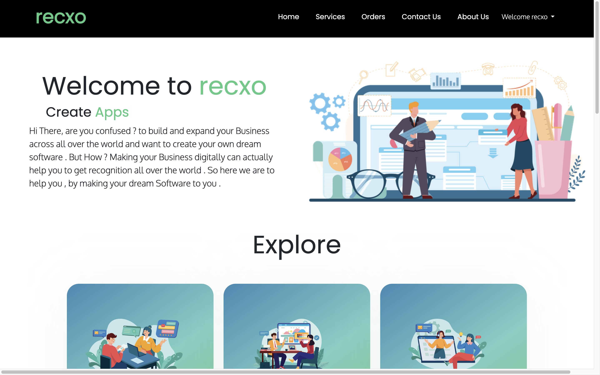

# Recxo

## How to set up recxo 
recxo has been built in django a python framework.

### Cloning the repository
--> Clone the repostiory using the command below:
``` 
git clone https://github.com/rishv1912/RECXO.git
```

--> Move into the directory where we have the project file:

```
cd RECXO
```

--> Create a virtual environment:
>You can use pip3 or pip according to your path variable

For Mac
```
# Let's install the virtual environment
pip3 install virtualenv

# Then we create our virtual environment
python3 -m venv [name]
```

For Windows
```
# Let's install the virtual environment
pip install virtualenv

# Then we create our virtual environment
virtual [name]
```

--> Activate the virtual environment:

For Mac
```
source env/bin/activate
```

For Windows
```
env\scripts\activate
```

--> Install the requirements:

>Again use pip or pip3 according your path variable, if pip doesn't work use pip3.

```
pip3 install -r requirement.txt
```
## Running the App

--> To run the App, we use:

>You can use python3 or python according to your path variable
```
python3 manage.py runserver
```

> Then the deployment server will start at [http://127.0.0.1:8000/](http://127.0.0.1:8000/)

## Recxo Preview

 

## Recxo Admin
Admin for controling the site 
>You can access by link [http://127.0.0.1:8000/admin](http://127.0.0.1:8000/admin)


Username : recxo  
Password : recxo098
>Username and password is for testing purpose so it can be changed in future so revisit to check it

## Admin Preview


